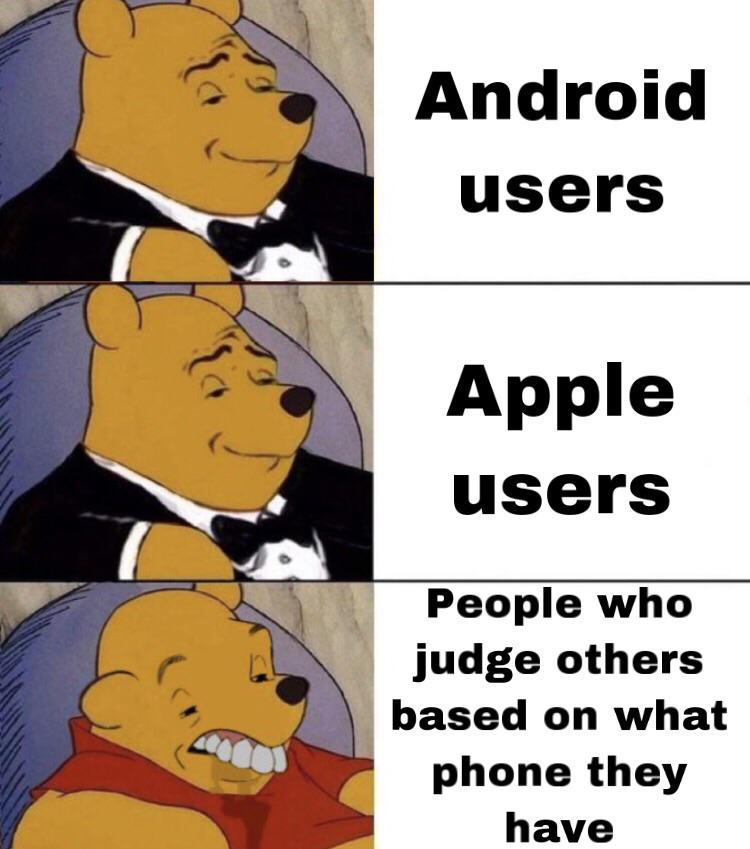

# IT304 / Mobile Application

## Table of contents
* [General info](#general-info)
* [Technologies](#technologies)
* [Tools & Services](#Tools-&-Services)

## General info
This a collection of project for IT304/MobileApp 
by CHRISTOPHER CHRISTIAN B. COSINGAN
	
## Technologies
This project is created with:
* Cordova
* Framework7
* Monaca
* Bootstrap 3 or 4
* Javascript
* JQuery
* AJAX
* HTML5
* CSS
* JAVA
	
## Tools & Services
This project is created using this tools and services:
* VSCode
* FontAwesome
* GitHub
* Gradle
* Chrome Browser
* RSS2JSON API

## Meme Time (͠≖ ͜ʖ͠≖)

